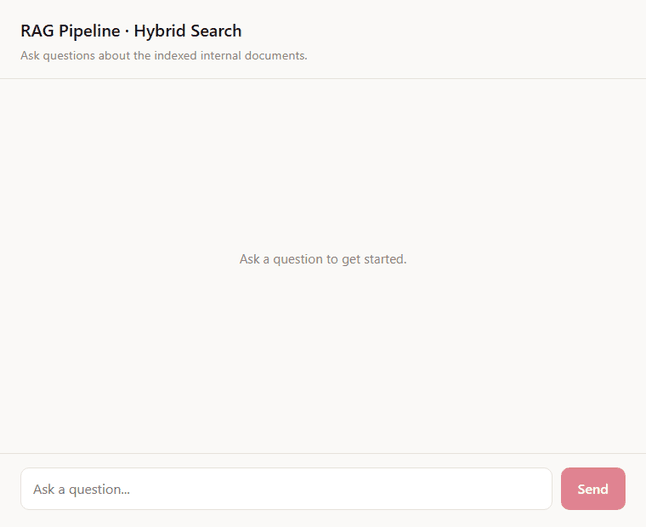

# RAG Pipeline with Hybrid Search Over Internal Docs



**Live demo:** [frontend-production-73e74.up.railway.app](https://frontend-production-73e74.up.railway.app) · **API docs:** [api-production-0632e.up.railway.app/docs](https://api-production-0632e.up.railway.app/docs)

Retrieval-Augmented Generation system with hybrid retrieval (dense embeddings + BM25 keyword search), reciprocal rank fusion, cross-encoder reranking, and grounded generation with citation verification and confidence scoring.

**95.5% composite score on a 70-question golden eval** (93.6% correctness, 98.3% faithfulness, 93.7% citation accuracy) — see [docs/case_study.md](docs/case_study.md) for the full breakdown, hybrid-vs-dense-only measurement, and chunking strategy comparison. Demo script: [docs/demo_script.md](docs/demo_script.md).

See [CLAUDE.md](CLAUDE.md) for the full architecture and build plan.

## Setup

1. Install dependencies:

   ```bash
   pip install -r requirements.txt
   ```

2. Copy `.env.example` to `.env` and fill in your keys:

   ```bash
   cp .env.example .env
   ```

   - `OPENAI_API_KEY` **or** the `AZURE_OPENAI_*` variables — used for embeddings.
   - `ANTHROPIC_API_KEY` — used for answer generation, citation verification, and confidence scoring.

## Usage

Drop documents (`.md`, `.txt`, `.html`, `.pdf`) into `data/raw/`, then:

```bash
# Ingest everything in data/raw/ (chunk -> embed -> index into ChromaDB + BM25)
python scripts/cli.py ingest data/raw

# Optional: pick a chunking strategy (default: recursive)
python scripts/cli.py ingest data/raw --strategy fixed_size   # or: recursive, semantic
```

```bash
# Ask a question against the ingested documents
python scripts/cli.py ask "your question here"

# Optional: control how many candidates are considered / kept after reranking
python scripts/cli.py ask "your question here" --candidate-k 20 --top-k 5
```

Each `ask` returns the cited answer, its sources, and a confidence breakdown (retrieval confidence, citation coverage, answer completeness). If retrieval confidence is too low, generation is skipped entirely and you get a pointer to the closest matching documents instead of a guess.

Re-running `ingest` on the same files is safe — near-duplicate chunks (cosine similarity > 0.95) are detected and skipped automatically.

### Eval suite

```bash
python scripts/eval.py --verbose
```

Runs the golden Q&A dataset (`data/eval/golden_dataset.json`) end-to-end and prints per-question and summary scores (correctness, faithfulness, retrieval relevance, citation accuracy).

### API server

```bash
uvicorn api.main:app --reload --app-dir src
```

- `POST /v1/ask` — question in, cited answer + sources + confidence breakdown out.
- `GET /v1/documents` — list indexed documents with chunk counts.
- `POST /v1/ingest` — ingest a directory of documents.

Interactive OpenAPI docs at `http://127.0.0.1:8000/docs`.

### Frontend

React chat UI that talks to the API over HTTP (needs the API server running first, per above).

```bash
cd frontend
npm install
npm run dev
```

Opens at `http://localhost:5173`. Ask a question, get a cited chat reply with color-coded confidence badges and expandable sources. If retrieval confidence is too low, the reply is styled distinctly and lists the closest documents instead of guessing. Point it at a non-default API URL via `frontend/.env` (`VITE_API_URL=...`, see `.env.example`).

## Docker

Runs the whole stack — a standalone ChromaDB server, the API, and the frontend — as 3 containers.

```bash
docker compose up --build
```

- Frontend: `http://localhost:5173`
- API + docs: `http://localhost:8000/docs`
- ChromaDB (for inspection): `http://localhost:8001`

On first boot, the API detects an empty index and automatically ingests `data/raw/` (bakes into the image at build time) — no manual seeding step needed. Data persists in named volumes (`chroma_data`, `bm25_data`) across restarts, so re-running `docker compose up` won't re-embed anything already indexed. Requires a `.env` file with your API keys in the project root (passed through to the `api` service).

## Project Structure

```text
src/
  ingestion/    # loaders (md/txt/html/pdf), chunkers, embeddings, ChromaDB + BM25 stores, dedup
  retrieval/    # dense, sparse (BM25), RRF fusion, cross-encoder reranker
  generation/   # grounded generation, citation verification, confidence scoring, RAG orchestration
  eval/         # golden dataset runner, LLM-judge metrics
  api/          # FastAPI app (ask / documents / ingest)
scripts/
  cli.py        # ingest / ask commands
  eval.py       # eval suite runner
frontend/       # React chat UI (Vite), own Dockerfile
data/
  raw/          # source documents
  processed/    # ChromaDB + BM25 index (generated, gitignored)
  eval/         # golden Q&A dataset + eval results
Dockerfile          # API image
docker-compose.yml  # chroma + api + frontend
```
